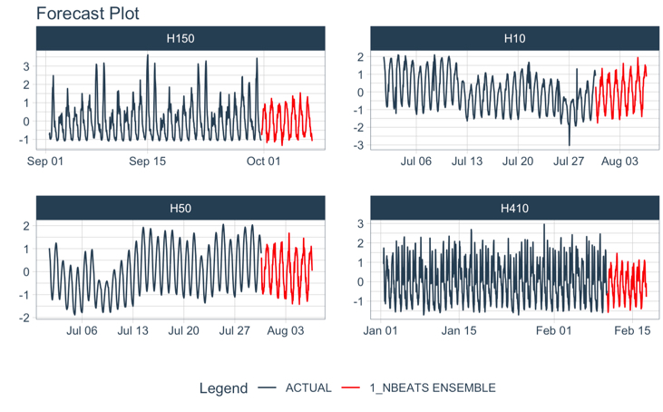

<!-- README.md is generated from README.Rmd. Please edit that file -->

# modeltime.gluonts

<!-- badges: start -->

[](https://travis-ci.com/business-science/modeltime.gluonts)
[](https://codecov.io/gh/business-science/modeltime)
[](https://cran.r-project.org/package=modeltime)


<!-- badges: end -->

> Deep Learning for Time Series, simplified.

**Important: This package is having ‘minor issues’ with CRAN acceptance
of updates. Because of this, please use the `development version`, which
is updated with the latest features.**

    remotes::install_github("business-science/modeltime.gluonts")

Modeltime GluonTS integrates the **Python GluonTS Deep Learning
Library**, making it easy to develop forecasts using Deep Learning for
those that are comfortable with the [Modeltime Forecasting
Workflow](https://business-science.github.io/modeltime/).



## GluonTS in R

Using `deep_ar()`, which connects to `GluonTS DeepAREstimator()`.

``` r
library(modeltime.gluonts)
library(tidymodels)
library(tidyverse)

# Fit a GluonTS DeepAR Model
model_fit_deepar <- deep_ar(
    id                    = "id",
    freq                  = "M",
    prediction_length     = 24,
    lookback_length       = 36,
    epochs                = 10, 
    num_batches_per_epoch = 50,
    learn_rate            = 0.001,
    num_layers            = 2,
    dropout               = 0.10
) %>%
    set_engine("gluonts_deepar") %>%
    fit(value ~ ., training(m750_splits))

# Forecast with 95% Confidence Interval
modeltime_table(
    model_fit_deepar
) %>%
    modeltime_calibrate(new_data = testing(m750_splits)) %>%
    modeltime_forecast(
        new_data      = testing(m750_splits),
        actual_data   = m750,
        conf_interval = 0.95
    ) %>%
    plot_modeltime_forecast(.interactive = FALSE)
```


## Installation

There are 2 key components to installing Modeltime GluonTS:

1.  Download the R-Package, `modeltime.gluonts`. This installs the
    R-Bindings, which allows you to interface with GluonTS.

2.  Set up the Python Environment so `modeltime.gluonts` can connect to
    the `gluonts` python package.

### Step 1 - Download & Install Modeltime GluonTS

Download the latest development version:

``` r
remotes::install_github("business-science/modeltime.gluonts")
```

Download the CRAN version:

``` r
install.packages("modeltime.gluonts")
```

### Step 2 - Python Environment Setup

Next, you’ll need to set up a Python Environment that contains at a
minimum:

-   `gluonts`
-   `mxnet`
-   `pandas`
-   `numpy`
-   `pathlib`

The python environment then needs to be activated with `reticulate`.

**Fast GluonTS Setup**

You can use `install_gluonts()` to prepare and bind to a python
environment containing `gluonts` and the required python packages. You
only need to run this one time, and then you are good to go. Each time
you load `modeltime.gluonts`, the package will include this environment
in it’s search process.

``` r
# GluonTS Installation
# - This sets up the Python Environment
# - Only need to run 1-time, then you're set!

install_gluonts()
```

### Step 3 - Restart R and Try an Example

Restart your R session (if in RStudio, close and re-open). Then try this
example.

``` r
library(modeltime.gluonts)
library(tidymodels)
library(tidyverse)

# Fit a GluonTS DeepAR Model
model_fit_deepar <- deep_ar(
    id                    = "id",
    freq                  = "M",
    prediction_length     = 24,
    lookback_length       = 36,
    epochs                = 10, 
    num_batches_per_epoch = 50,
    learn_rate            = 0.001,
    num_layers            = 2,
    dropout               = 0.10
) %>%
    set_engine("gluonts_deepar") %>%
    fit(value ~ ., training(m750_splits))

# Forecast with 95% Confidence Interval
modeltime_table(
    model_fit_deepar
) %>%
    modeltime_calibrate(new_data = testing(m750_splits)) %>%
    modeltime_forecast(
        new_data      = testing(m750_splits),
        actual_data   = m750,
        conf_interval = 0.95
    ) %>%
    plot_modeltime_forecast(.interactive = FALSE)
```

## Troubleshooting Installation

Python Environment setup is always fun. Here are a few recommendations
if you run into an issue.

-   **Check to make sure Conda or Miniconda is available** using
    `reticulate::conda_version()`. If no conda version is returned, then
    use `reticulate::install_miniconda()` to install Miniconda
    (recommended vs full Aniconda). Then (re-)run `install_gluonts()`.

-   **Check if GluonTS (Python) is available** using
    `reticulate::py_module_available("gluonts")`. If this returns
    `TRUE`, then your installation has succeeded in building the
    environment, but you may have other issues like missing C++ build
    tools (next).

-   **Windows 10 error: Microsoft Visual C++ is required.** [Here are
    the instructions for installing the C++ tools
    needed.](https://github.com/business-science/modeltime.gluonts/issues/4)

-   **Other installation issues.** [Please file a GitHub issue
    here.](https://github.com/business-science/modeltime.gluonts/issues)

# Learning More

<a href="https://www.youtube.com/embed/elQb4VzRINg" target="_blank"></a>

[*My Talk on High-Performance Time Series
Forecasting*](https://youtu.be/elQb4VzRINg)

Time series is changing. **Businesses now need 10,000+ time series
forecasts every day.** This is what I call a *High-Performance Time
Series Forecasting System (HPTSF)* - Accurate, Robust, and Scalable
Forecasting.

**High-Performance Forecasting Systems will save companies MILLIONS of
dollars.** Imagine what will happen to your career if you can provide
your organization a “High-Performance Time Series Forecasting System”
(HPTSF System).

I teach how to build a HPTFS System in my **High-Performance Time Series
Forecasting Course**. If interested in learning Scalable
High-Performance Forecasting Strategies then [take my
course](https://university.business-science.io/p/ds4b-203-r-high-performance-time-series-forecasting).
You will learn:

-   Time Series Machine Learning (cutting-edge) with `Modeltime` - 30+
    Models (Prophet, ARIMA, XGBoost, Random Forest, & many more)
-   NEW - Deep Learning with `GluonTS` (Competition Winners)
-   Time Series Preprocessing, Noise Reduction, & Anomaly Detection
-   Feature engineering using lagged variables & external regressors
-   Hyperparameter Tuning
-   Time series cross-validation
-   Ensembling Multiple Machine Learning & Univariate Modeling
    Techniques (Competition Winner)
-   Scalable Forecasting - Forecast 1000+ time series in parallel
-   and more.

<p class="text-center" style="font-size:30px;">
<a href="https://university.business-science.io/p/ds4b-203-r-high-performance-time-series-forecasting">Unlock
the High-Performance Time Series Forecasting Course</a>
</p>
