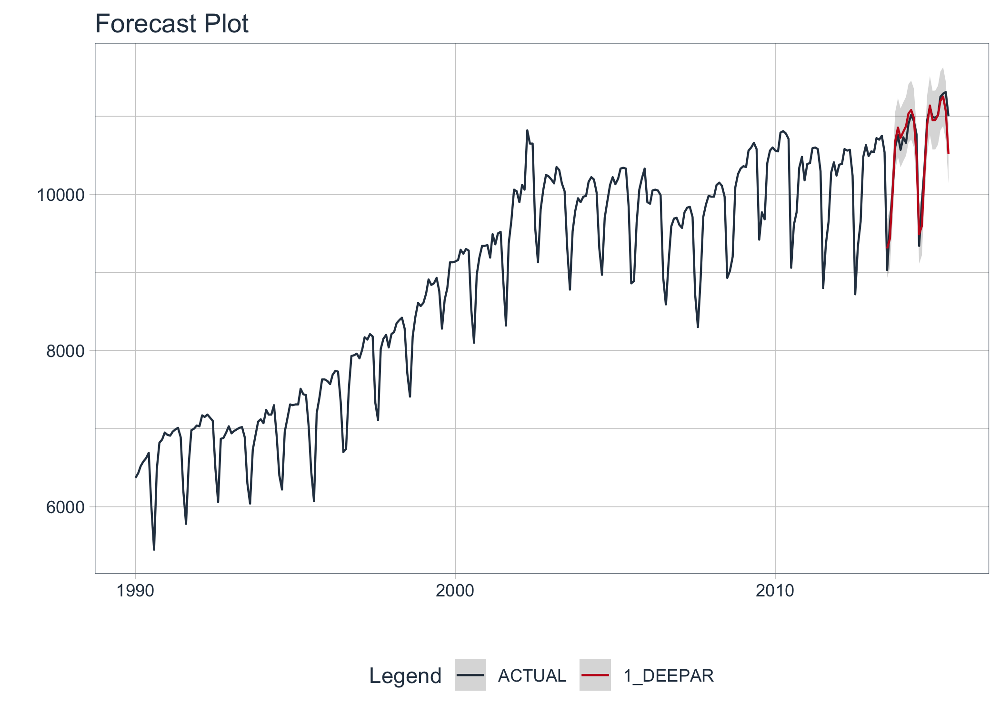

<!-- README.md is generated from README.Rmd. Please edit that file -->

# modeltime.gluonts

<!-- badges: start -->

<!-- badges: end -->

> Deep Learning for Time Series is simplified with `modeltime.gluonts`.

**Important: This package is exprimental. Functions may change until the
package matures.**

Modeltime GluonTS integrates the **Python GluonTS Deep Learning
Library**, making it easy to use for those that are comfortable with the
[Modeltime Forecasting
Workflow](https://business-science.github.io/modeltime/).

## GluonTS in R

Using `deep_ar()`, which connects to `GluonTS DeepAREstimator()`.

``` r
library(modeltime.gluonts)
library(tidymodels)
library(tidyverse)

# Fit a GluonTS DeepAR Model
model_fit_deepar <- deep_ar(
    id                    = "id",
    freq                  = "M",
    prediction_length     = 24,
    epochs                = 10, 
    num_batches_per_epoch = 50,
    learn_rate            = 0.001,
    num_layers            = 2,
    dropout               = 0.10
) %>%
    set_engine("gluonts") %>%
    fit(value ~ ., training(m750_splits))

# Forecast with 95% Confidence Interval
modeltime_table(
    model_fit_deepar
) %>%
    modeltime_calibrate(new_data = testing(m750_splits)) %>%
    modeltime_forecast(
        new_data      = testing(m750_splits),
        actual_data   = m750,
        conf_interval = 0.95
    ) %>%
    plot_modeltime_forecast(.interactive = FALSE)
```



## Installation

`modeltime.gluonts` is currently available on GitHub only. **Not on CRAN
yet.**

``` r
remotes::install_github("business-science/modeltime.gluonts")
```

## Required: Python Environment Setup

**Important:** Use `install_gluonts()` to set up the “r-gluonts”
`python` environment used by `modeltime.gluonts`. You only need to do
this once, when you first set up the package.

``` r
modeltime.gluonts::install_gluonts()
```

# Learning More

<a href="https://www.youtube.com/embed/elQb4VzRINg" target="_blank"></a>

[*My Talk on High-Performance Time Series
Forecasting*](https://youtu.be/elQb4VzRINg)

Time series is changing. **Businesses now need 10,000+ time series
forecasts every day.** This is what I call a *High-Performance Time
Series Forecasting System (HPTSF)* - Accurate, Robust, and Scalable
Forecasting.

**High-Performance Forecasting Systems will save companies MILLIONS of
dollars.** Imagine what will happen to your career if you can provide
your organization a “High-Performance Time Series Forecasting System”
(HPTSF System).

I teach how to build a HPTFS System in my **High-Performance Time Series
Forecasting Course**. If interested in learning Scalable
High-Performance Forecasting Strategies then [take my
course](https://university.business-science.io/p/ds4b-203-r-high-performance-time-series-forecasting).
You will learn:

  - Time Series Machine Learning (cutting-edge) with `Modeltime` - 30+
    Models (Prophet, ARIMA, XGBoost, Random Forest, & many more)
  - NEW - Deep Learning with `GluonTS` (Competition Winners)
  - Time Series Preprocessing, Noise Reduction, & Anomaly Detection
  - Feature engineering using lagged variables & external regressors
  - Hyperparameter Tuning
  - Time series cross-validation
  - Ensembling Multiple Machine Learning & Univariate Modeling
    Techniques (Competition Winner)
  - Scalable Forecasting - Forecast 1000+ time series in parallel
  - and more.

<p class="text-center" style="font-size:30px;">

<a href="https://university.business-science.io/p/ds4b-203-r-high-performance-time-series-forecasting">Unlock
the High-Performance Time Series Forecasting Course</a>

</p>
