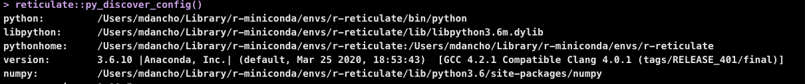

```{r, include = FALSE}
knitr::opts_chunk$set(
  collapse = TRUE,
  comment = "#>",
  warning = FALSE, 
  message = FALSE,
  fig.align = "center",
  out.width = "90%",
  fig.width = 7,
  fig.height = 5
)
```

This section covers how to create, modify, and customize GluonTS Python Environments. 

## Package Requirements

The `modeltime.gluonts` has the following minimum requirements:

- A recent version of Python (Recommend >= 3.6)
- A Python environment containing:
  - `gluonts`
  - `mxnet`
  - `pandas`
  - `numpy`
  - `pathlib`
  
That's it. If you have these inside a Conda or Virtual Environment, then you can use `modeltime.gluonts`.

## Connecting Your Python Environment

There are 2 main ways to connect an python environment to `modeltime.gluonts`:

1. Default GluonTS Setup (Quick, Painless, Easy)

2. Custom Environment Setup (Not too bad either, but has gotchas)

## Method 1: Default GluonTS Setup

This process uses the __Conda Package Manager__ to set up a new conda environment called "r-gluonts". It's quick and easy, and most importantly the package versions that are selected all work together (I test them when developing).

### 1. Make sure you have conda

Get the conda version. If you don't have conda, then install with `reticulate::install_miniconda()` or `reticulate::conda_install()`.

``` r
reticulate::conda_version()
``` 


### 2. Run install_gluonts() (set up the Default Environment):

``` r
modeltime.gluonts::install_gluonts()
```


### 3. [Optional] Modifying the Default Environment:

You can modify this environment, adding more python libraries as needed. 

``` r
reticulate::py_install(
    envname  = "r-gluonts",
    packages = c(
        "sklearn"
    ),
    method = "conda",
    pip = TRUE
)
```

### 4. Activate the Default Environment:

Each time you load `library(modeltime.gluonts)`, the package will bind to the "r-gluonts" python environment by default. If found, it will automatically bind to this environment. 

``` r
library(modeltime.gluonts)
```

### 5. Check the Environment

Make sure that the environment has been changed to the default 'r-gluonts' environment. We can see that `r-gluonts` environment is being used in the python path. 

``` r
reticulate::py_discover_config()
```

```{r, echo=F}
knitr::include_graphics("discover_config_rgluonts.jpg")
```


## Method 2: Custom GluonTS Python Environments

It's quite possible you may have a Virtual Environment or different Conda Environment that you would prefer to use. This is possible by setting a __System Environment Variable named 'GLUONTS_PYTHON'__ before running `library(modeltime.gluonts)`.

### 1. [GOTCHA #1] Restart R Session 

You will need to restart R session if you've already used a `reticulate` environment or run `library(modeltime.gluonts)`. Restarting the R Session is the only current way to disconnect from an active Python Environment. 

Make sure that the environment has been changed to the default reticulate environment. We can see that `r-reticulate` environment is being used. 

``` r
reticulate::py_discover_config()
```

```{r, echo=F}

```


### 2. Create a Custom Python Environment

You can create an environment containing the python packages needed. 

``` r
reticulate::py_install(
    envname  = "my_gluonts_env",
    python_version = "3.6",
    packages = c(
        "mxnet==1.6.0",
        "gluonts==0.6.3",
        "pandas",
        "numpy",
        "pathlib"
    ),
    method = "conda",
    pip = TRUE
)
```

### 3. Locate the Python Path

This locates the path to the python executable for the 'my_gluonts_env' environment that we just created. 

``` r
library(dplyr)
my_gluonts_env_python_path <- reticulate::conda_list() %>%
    filter(name == "my_gluonts_env") %>%
    pull(python)

my_gluonts_env_python_path
#> "/Users/mdancho/Library/r-miniconda/envs/my_gluonts_env/bin/python"
```

### 4. Set the System Environment Variable

Set the system environment variable named 'GLUONTS_PYTHON' with the path to the python executable. Once this is set, loading `library(modeltime.gluonts)` will use this path to activate the environment. 

``` r
Sys.setenv(GLUONTS_PYTHON = my_gluonts_env_python_path)
```

Verify it's been set.

``` r
Sys.getenv("GLUONTS_PYTHON")
#> "/Users/mdancho/Library/r-miniconda/envs/my_gluonts_env/bin/python"
```

### 5. Load Modeltime GluonTS

Running `library(modeltime.gluonts)` now binds to the custom environment. 

``` r
library(modeltime.gluonts)
```

### 6. [Gotcha #2] Check Your Environment

Make sure that the environment has been changed to the default reticulate environment. We can see that  environment is being used. If setting your python environment was done properly, you should see `my_gluonts_env` in the Python Path. 

``` r
reticulate::py_discover_config()
```

```{r, echo=F}
knitr::include_graphics("discover_config_custom.jpg")
```

