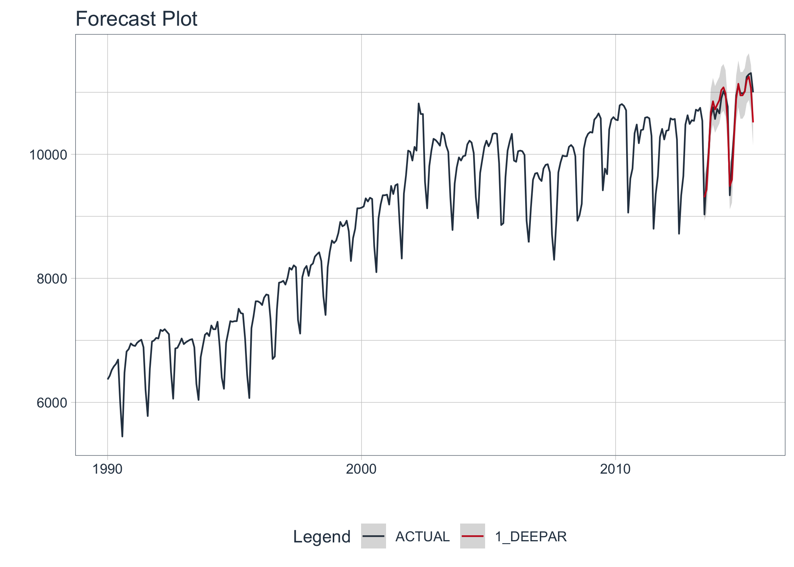

```{r, include = FALSE}
knitr::opts_chunk$set(
  collapse = TRUE,
  comment = "#>",
  warning = FALSE, 
  message = FALSE,
  fig.align = "center",
  out.width = "90%",
  fig.width = 7,
  fig.height = 5
)
```

These are the full instructions to get `modeltime.gluonts` installed, the python dependencies installed, and to connect R and Python together so you can forecast with amazing accuracy. 

```{r, echo = F}
knitr::include_graphics("../man/figures/m4_hourly_forecast.jpg")
```


# Installation

There are 2 key components to installing `modeltime.gluonts`:

1. Download the R-Package, `modeltime.gluonts`. This installs the R-Bindings, which allows you to interface with GluonTS. 

2. Set up the Python Environment so `modeltime.gluonts` can connect to the `gluonts` python package. 

### Step 1: Download & Install Modeltime GluonTS

Modeltime GluonTS is maintained on GitHub and can be installed using:

``` r
remotes::install_github("business-science/modeltime.gluonts")
```

### Step 2: Default Python Environment Setup

We've provided a helper function, `install_gluonts()` to prepare and bind to a python environment containing `gluonts` and the required python packages. 

- You only need to run this one time, and then you are good to go. 
- Each time you load `modeltime.gluonts`, the package will include this environment in it's search process. 


```{r, eval=F}
# GluonTS Installation - Run 1st time
install_gluonts(fresh_install = FALSE, include_pytorch = FALSE)
```

What happens:

- `fresh_install`: Default: `FALSE`. If `TRUE`, this removes any previous "r-gluonts" environments, which can help in the case of errors. _Caution: If you have added packages to this environment after a prior install, these packages will be removed._

- `include_pytorch`:  Default: `FALSE`. If `TRUE`, will install the optional Pytorch and Pytorch Lightning dependencies for use with the "torch" engine, which is available in models such as `deep_ar()`.

### Step 3: Restart R and Try an Example

Restart your R session (if in RStudio, close and re-open). Then try this example. 

```{r, eval=F}
library(modeltime.gluonts)
library(tidymodels)
library(tidyverse)

# Fit a GluonTS DeepAR Model
model_fit_deepar <- deep_ar(
    id                    = "id",
    freq                  = "M",
    prediction_length     = 24,
    lookback_length       = 48,
    epochs                = 5
) %>%
    set_engine("gluonts_deepar") %>%
    fit(value ~ ., training(m750_splits))

# Forecast with 95% Confidence Interval
modeltime_table(
    model_fit_deepar
) %>%
    modeltime_calibrate(new_data = testing(m750_splits)) %>%
    modeltime_forecast(
        new_data      = testing(m750_splits),
        actual_data   = m750,
        conf_interval = 0.95
    ) %>%
    plot_modeltime_forecast(.interactive = FALSE)
```

```{r, echo = F}

```

# Upgrading to Modeltime GluonTS >= 0.3.0

Modeltime GluonTS 0.3.0 introduced new features that are only available in GluonTS >= 0.8.0. To incorporate these features, we now need to upgrade GluonTS. 

First, upgrade `modeltime.gluonts`:

``` r
remotes::install_github("business-science/modeltime.gluonts")
```

Next, we recommend running `install_gluonts()` with `fresh_install = TRUE`. This will completely replace your previous "r-gluonts" python environment with a new one. It's designed to help reduce the likelihood of errors during the upgrading process.

``` r
install_gluonts(fresh_install = TRUE)
```

Optionally, you can add the __Pytorch Backend__ (new feature) with:

``` r
install_gluonts(fresh_install = TRUE, include_pytorch = TRUE)
```

# Troubleshooting Installation

Python Environment setup is always fun. Here are a few recommendations if you run into an issue.

- __Check to make sure Conda or Miniconda is available__ using `reticulate::conda_version()`. If no conda version is returned, then use `reticulate::install_miniconda()` to install Miniconda (recommended vs full Aniconda). Then (re-)run `install_gluonts()`. 

- __Check if GluonTS (Python) is available__ using `reticulate::py_module_available("gluonts")`. If this returns `TRUE`, then your installation has succeeded in building the environment, but you may have other issues like missing C++ build tools (next).

- __Windows 10 error: Microsoft Visual C++ is required.__ [Here are the instructions for installing the C++ tools needed.](https://github.com/business-science/modeltime.gluonts/issues/4) 

- __Other installation issues.__ [Please file a GitHub issue here.](https://github.com/business-science/modeltime.gluonts/issues)

# Python Environment Requirements

The `modeltime.gluonts` >= 0.3.0 has the following minimum python environment requirements. We provide a helper function `install_gluonts()` to help set these up.

- A recent version of Python (Recommend 3.7)
- A Python environment containing the "GluonTS Stack":
  - `gluonts>=0.8.0` (required for `modeltime.gluonts` >= 0.3.0)
  - `mxnet`
  - `pandas`
  - `numpy`
  - `pathlib`
  
Optional: Dependencies for Pytorch:

  - `torch`
  - `pytorch_lightning`
  
That's it. If you have these inside a Conda or Virtual Environment, then you can use `modeltime.gluonts`.

# Custom Python Environments

There are 2 main ways to connect an python environment to `modeltime.gluonts`:

1. __Default GluonTS Environment Setup__: Most proven. Modeltime GluonTS creates an 'r-gluonts' environment with python package versions that were tested.

2. __Custom GluonTS Environment Setup__: Most flexible. You create the environment, you ensure that dependency requirements are met, and you define how to connect to it.

## Method 1: Modifying the Default Environment Setup

This process uses the __Conda Package Manager__ to set up a new conda environment called "r-gluonts". It's quick and easy, and most importantly the package versions that are selected all work together (I test them when developing). And, you can modify it once created.

### 1. Make sure you have conda

Get the conda version. If you don't have conda, then install with `reticulate::install_miniconda()` or `reticulate::conda_install()`.

``` r
reticulate::conda_version()
``` 


### 2. Run install_gluonts() (set up the Default Environment):

This downloads the "GluonTS Stack" that the `modeltime.gluonts` package is tested using and places it into a Conda environment named "r-gluonts". When you run `library("modeltime.gluonts")`, it attempts to use the "r-gluonts" environment. 

``` r
modeltime.gluonts::install_gluonts()
```


### 3. [Optional] Modifying the Default Environment:

You can modify this environment, adding more python libraries as needed. 

``` r
reticulate::py_install(
    envname  = "r-gluonts",
    packages = c(
        "sklearn"
    ),
    method = "conda",
    pip = TRUE
)
```

### 4. Activate the Default Environment:

Each time you load `library(modeltime.gluonts)`, the package will bind to the "r-gluonts" python environment by default. If found, it will automatically bind to this environment. 

``` r
library(modeltime.gluonts)
```

### 5. Check the Environment

Make sure that the environment has been changed to the default 'r-gluonts' environment. We can see that `r-gluonts` environment is being used in the python path. 

``` r
reticulate::py_discover_config()
```

```{r, echo=F}
knitr::include_graphics("discover_config_rgluonts.jpg")
```


## Method 2: Making Custom Environments

It's quite possible you may have a Virtual Environment or different Conda Environment that you would prefer to use. This is possible by setting a __System Environment Variable named 'GLUONTS_PYTHON'__ before running `library(modeltime.gluonts)`.

### 1. Create a Custom Python Environment

You can create an environment containing the python packages needed. 

``` r
reticulate::py_install(
    envname  = "my_gluonts_env",
    python_version = "3.7",
    packages = c(
        "mxnet~=1.7",
        "gluonts==0.8.0",
        "pandas",
        "numpy",
        "pathlib"
    ),
    method = "conda",
    pip = TRUE
)
```

### 2. Locate the Python Path

This locates the path to the python executable for the 'my_gluonts_env' environment that we just created. 

``` r
library(dplyr)
my_gluonts_env_python_path <- reticulate::conda_list() %>%
    filter(name == "my_gluonts_env") %>%
    pull(python)

my_gluonts_env_python_path
#> "/Users/mdancho/Library/r-miniconda/envs/my_gluonts_env/bin/python"
```

### 3. Set the System Environment Variable

Set the system environment variable named 'GLUONTS_PYTHON' with the path to the python executable. Once this is set, loading `library(modeltime.gluonts)` will use this path to activate the environment. 

``` r
Sys.setenv(GLUONTS_PYTHON = my_gluonts_env_python_path)
```

Verify it's been set.

``` r
Sys.getenv("GLUONTS_PYTHON")
#> "/Users/mdancho/Library/r-miniconda/envs/my_gluonts_env/bin/python"
```

### 5. Load Modeltime GluonTS

Running `library(modeltime.gluonts)` now binds to the custom environment. 

``` r
library(modeltime.gluonts)
```

### 6. [Gotcha #1] Check Your Environment

Make sure that the environment has been changed to the default reticulate environment. We can see that  environment is being used. If setting your python environment was done properly, you should see `my_gluonts_env` in the Python Path. 

__Troubleshooting__: If the incorrect environment is shown, simply restart your R Session, 

``` r
reticulate::py_discover_config()
```

```{r, echo=F}
knitr::include_graphics("discover_config_custom.jpg")
```

